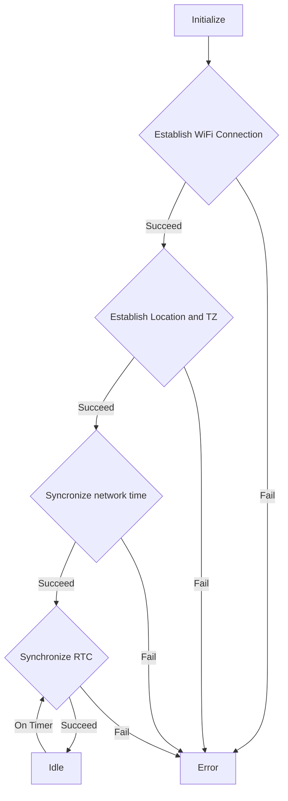

# GrandfatherClock

```mermaid
flowchart TD
  Init[Initialize]-->WiFi{Establish WiFi Connection}
  WiFi -- Succeed -->Location{Establish Location and TZ}
  WiFi -- Fail -->Error
  Location -- Succeed -->NTP{Syncronize network time}
  Location -- Fail -->Error
  NTP -- Succeed -->DS3231{Synchronize RTC}
  NTP -- Fail -->Error
  DS3231-- Succeed -->Idle
  DS3231 -- Fail --> Error
  Idle-- On Timer -->DS3231
```
