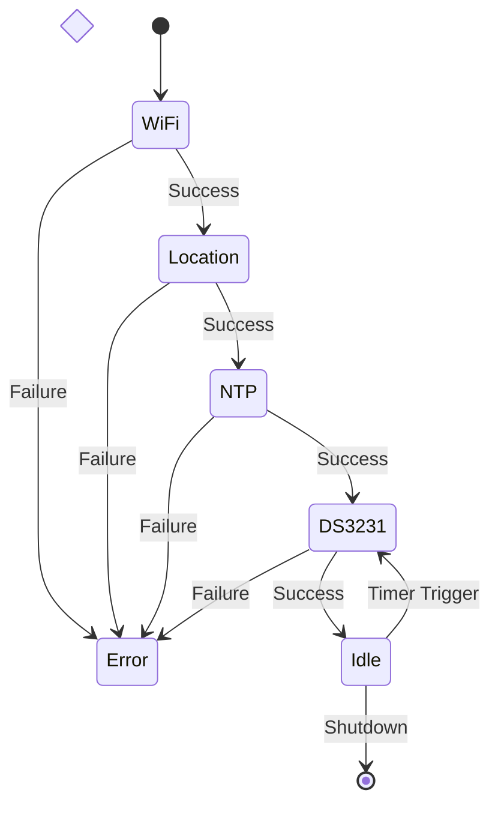

# GrandfatherClock

```mermaid
stateDiagram-v2
  state "Establish WiFi connection" as WiFi <<choice>>
  state Location: Establish Location and TZ
  state NTP: Synchronize network time
  state DS3231: Synchronize RTC
  [*]-->WiFi
  WiFi -->Location : Success
  WiFi -->Error : Failure
  Location -->NTP : Success
  Location -->Error : Failure
  NTP -->DS3231 : Success
  NTP -->Error : Failure
  DS3231 -->Idle : Success
  DS3231 --> Error : Failure
  Idle -->DS3231 : Timer Trigger
  Idle-->[*] : Shutdown
```
